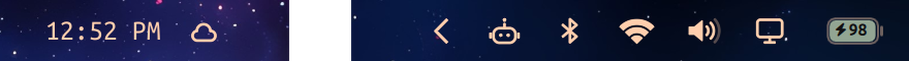
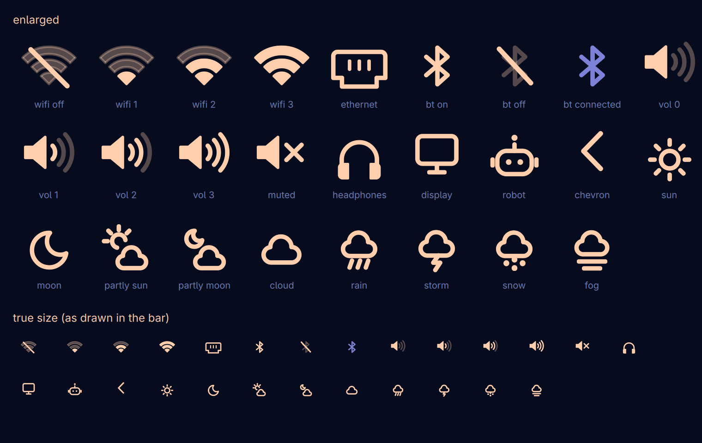

# iOS-style icons for the Omarchy top bar

Turns the status icons in the [Omarchy](https://omarchy.org) top bar into one consistent, iPhone-status-bar-style
set: the Wi-Fi fan, a battery with the number in it, a speaker with waves, the bluetooth rune, and matching
weather icons. Everything follows your theme and reacts to real state (signal strength, volume, mute, charging...).

<p align="center"></p>

<p align="center"></p>

**What changes**

| Bar item | Now | States |
|---|---|---|
| Battery | rounded outline, nub, fill, number cut into the fill, bolt | charging = theme green, <= 20% = theme red, otherwise foreground |
| Wi-Fi | iOS fan (wedge + two arcs) | 1-3 bars by signal, dimmed bars, slashed when offline, ethernet port |
| Volume | speaker + waves | 0-3 waves by volume, x when muted, headphones for headsets |
| Bluetooth | rune | slashed when off, theme accent when a device is connected |
| Display, agents, tray chevron | display, outlined robot, chevron | agents highlights like the stock widget when alarming |
| Weather | sun, moon, partly cloudy (day/night), cloud, rain, sleet, storm, snow, fog | follows the weather widget's own condition |

The left side (Omarchy logo, workspaces) and the clock are untouched.

## Requirements

- Omarchy **4.0.4** (tested; `./install.sh --check` tells you if your Omarchy's stock widgets still match)
- Qt 6.6+ (uses the curve renderer for smooth vector shapes; Omarchy 4 ships Qt 6.11), `patch`, `python3`
- Optional, for the measuring tool: `grim`, ImageMagick

## Install

```bash
git clone https://github.com/thediamondsaint/omarchy-ios-bar.git
cd omarchy-ios-bar
./install.sh --check      # read-only: do the patches apply to your Omarchy's stock widgets?
./install.sh              # clone + patch the widgets, install the icon kit, reload the shell
```

`--check` prints one line per widget, e.g. `ok  network  (exact)` or `ok  network  (adaptive)`. **Exact** means the
patch in `patches/` (written against Omarchy 4.0.4) applies as is; **adaptive** means your Omarchy build differs slightly
and `tools/apply-widget.py` makes the same change structurally. Each widget is handled on its own: one that fits neither
way is skipped and the rest are still installed.

The installer backs up `~/.config/omarchy/shell.json` first (cloning a widget rewrites its entry in the bar layout).
`./install.sh --status` shows what is installed. **Undo:** `./uninstall.sh` (removes the clones, the bar goes back to
the stock widgets).

Never edit files under `/usr/share/omarchy`: Omarchy overwrites them on update. The installer follows Omarchy's own
rule and clones each built-in widget into `~/.config/omarchy/plugins/<username>.<widget>` with `omarchy plugin clone`,
then patches the clone. Your clones survive updates; upstream changes to those widgets just won't reach them.

## How it works

```
ioskit/IosIcon.qml     the icon kit: one component that draws every icon as vector paths
patches/*.patch        one small patch per widget, against the stock file (verified byte-exact on 4.0.4)
tools/apply-widget.py  adaptive installer: the same change, found by structure instead of exact context lines
tools/measure-bar.py   measure icon sizes/alignment from a screenshot
extras/icon-preview/   optional plugin: a window drawing every icon in every state
install.sh, uninstall.sh
```

1. **`BarIconButton` accepts `iconComponent`.** The stock widgets pass a text glyph (`text: root.icon`); a widget can
   instead give it a `Component` to draw. Each patch sets `text: ""` and an `iconComponent` that instantiates `IosIcon`
   with the widget's *existing* state (`root.signalStrength`, `root.outputMuted`, `root.connectedDevices`, ...), so the
   icons stay live. Colours come from the button (`button.foreground`, theme accent), so they follow theme switches.
2. **`IosIcon` draws on a 24x24 grid** with `QtQuick.Shapes` (`PathSvg`, curve renderer). One layer per shape, one stroke
   weight, round caps and joins, dimmed parts at ~30% opacity. Wi-Fi/weather clouds are built from geometry
   (annular sectors, three-lobe clouds from circle intersections) rather than hand-typed coordinates.
3. **Sizes are set by ink, not by box.** A Wi-Fi fan fills less of the grid than a bluetooth rune, so each icon has a
   measured "ink height" and is scaled so every icon is the same visual height; strokes are the same pixel weight
   everywhere. The tables `inkH / inkCx / inkCy` at the top of `IosIcon.qml` hold the calibration.
4. **The battery** is drawn inline in the power widget (it needs the number knocked out of the fill), and its charging
   colour is the theme's own `green`, read from the theme's `colors.toml` and reloaded on theme change.

## Troubleshooting

- **`CONFLICT <widget>` in `--check`.** Neither the exact patch nor the adaptive patcher fits that widget in your Omarchy
  build; it is skipped and everything else still installs. Please open an issue with the output of `omarchy version` and
  `grep -n "BarIconButton" -B2 -A10 /usr/share/omarchy/shell/plugins/panels/<widget>/Panel.qml`. To do it by hand, follow
  step 3 of "Make your own" below.
- **Nothing changed on the bar.** Plugin QML is cached: `omarchy restart shell`. Then look for QML errors:
  `journalctl --user --since "-2min" --no-pager | grep -iE "typeerror|referenceerror|cannot load|is not a type"`.
- **An icon is missing or looks like an empty gap.** Your Omarchy build probably names a property the widget uses
  differently (for example `signalStrength` in the network widget). It degrades to a dimmed icon rather than crashing;
  edit the `iconComponent` block in your clone (`~/.config/omarchy/plugins/<user>.<widget>/`) to use the right property.
- **Icons are the wrong size or sit too high/low.** Run `tools/measure-bar.py` (see below) and adjust `inkH`/`inkCy` in
  `~/.config/omarchy/plugins/ioskit/IosIcon.qml`. The nudge and sizes scale with the bar's `iconCanvas`, so a different
  bar font size or display scale usually works, but the calibration was done on a 2x display.
- **Go back to stock.** `./uninstall.sh` (or `omarchy plugin remove <user>.<widget>` for a single widget).

## Make your own (the method)

This is how the set was built; the same approach works for any bar widget.

1. **Survey.** `omarchy plugin list`, and read how each stock widget picks its icon
   (`grep -n "BarIconButton" -A6 /usr/share/omarchy/shell/plugins/panels/*/Panel.qml`).
2. **Clone, don't edit.** `omarchy plugin clone omarchy.network` -> edit the clone's `Panel.qml`.
3. **Replace the glyph with a drawn icon.** Keep the widget's own state logic; set `text: ""` and
   `iconComponent: Component { IosIcon { kind: "wifi"; level: ...; color: button.foreground } }`.
4. **Reload properly.** Plugin QML is cached: run `omarchy restart shell` after edits, then check
   `journalctl --user --since -20s | grep -iE "typeerror|referenceerror|cannot"` for QML errors.
5. **Preview every state.** You can't unplug the network to see "offline". `extras/icon-preview` draws every icon in every
   state at two sizes; it can save its own PNG (`omarchy-shell shell call ios-bar.icon-preview snapshot /tmp/icons.png`),
   which also avoids capturing the rest of your desktop.
6. **Measure, don't eyeball.** Drawn items are centred geometrically but the bar's text glyphs sit lower in their canvas.
   `tools/measure-bar.py --region "X,Y WxH" --names a,b,c` prints each icon's height and vertical centre from a screenshot;
   adjust `inkH`/`inkCy` until they agree (this repo converged to 25 px tall, centred at 30.5 px, on a 2x display).
   An automated loop (measure -> adjust the tables -> `omarchy restart shell` -> repeat) converges in a few iterations.
7. **Package as patches against the stock files** and verify each one:
   `diff -u stock modified > x.patch`, then `patch stock_copy < x.patch && cmp stock_copy modified`.

### Pitfalls worth knowing

- Computing the vertical nudge from font metrics was unreliable (`TextMetrics` has no `ascent`; `FontMetrics` values
  differed between load and render). A NaN in an anchors offset makes the item vanish silently. Calibrate by measurement.
- Only count pixels in the icon colour when measuring; stars in a wallpaper and dimmed bars will skew bounding boxes.
- `grim -g` takes logical pixels and `WxH` with an `x`; on a 2x display the capture is twice as large.
- When previewing, make the window opaque (`tag = "-default-opacity"`, `opacity = "1 1"`), or the desktop shows through.
- If Omarchy updates a stock widget, `./install.sh --check` reports a conflict; the patches are small enough to apply by hand.

## Tuning

Everything lives in `ioskit/IosIcon.qml` (`inkTarget`, `strokePx`, `dimOpacity`, and the `inkH`/`inkCx`/`inkCy` tables) and,
for the battery, the "iPhone-style battery" block of the power patch (`bodyH`, `bodyW`, `glyphInkDrop`). Edit the kit in
`~/.config/omarchy/plugins/ioskit/`, then `omarchy restart shell`.

## License

MIT, see [LICENSE](LICENSE).
